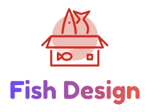

Fish Design

  
  

# ✨ 特性 
 - **📦 开箱即用**的Vue组件
 - **🦾 使用TypeScript 开发**，提供完整的类型定义文件
 - **🚀 更加轻量的原子化css**，舍弃tailwindcss、windicss,采用unocss让样式文件体积进一步缩小，打包构建速度更加快速
# 如何使用
Fish Design现已发布到npm  
- 支持npm 下载  
`npm i fish-design-vite`
- 支持脚手架快速创建基于fish design的vue模板项目  
`npm i create-fish-app-cli -g`  
并使用命令`create-fish`即可快速交互式创建新项目
# 📕 组件库文档
组件库支持在线文档查看支持的组件与api等使用方法  
点击立即查看👀->[Fish Design 文档](https://fish-design-fish-design-vite.vercel.app/)
# 😘 欢迎参与贡献
任何觉得不好的或者希望支持的功能都可以提issue，我会尽量解决哟
当然也可以直接提pr
> 注意：请遵循 commit 规范

- <strong>feat</strong>: 新功能、新特性
- <strong>fix</strong>: 修改 bug
- <strong>perf</strong>: 更改代码，以提高性能
- <strong>refactor</strong>: 代码重构（重构，在不影响代码内部行为、功能下的代码修改）
- <strong>docs</strong>: 文档修改
- <strong>style</strong>: 代码格式修改, 注意不是 css 修改（例如分号修改）
- <strong>test</strong>: 测试用例新增、修改
- <strong>build</strong>: 影响项目构建或依赖项修改
- <strong>revert</strong>: 恢复上一次提交
- <strong>ci</strong>: 持续集成相关文件修改
- <strong>chore</strong>: 其他修改（不在上述类型中的修改）
- <strong>release</strong>: 发布新版本
- <strong>workflow</strong>: 工作流相关文件修改
